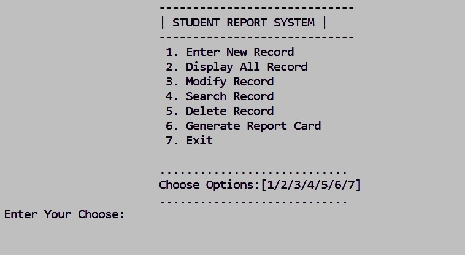
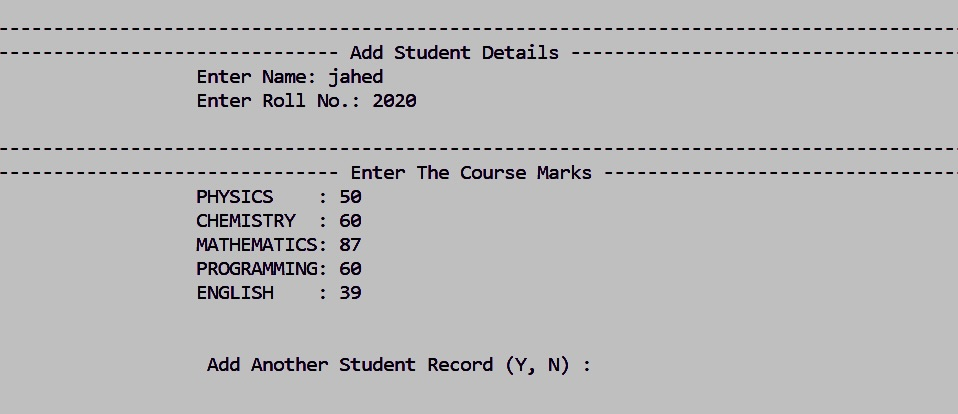
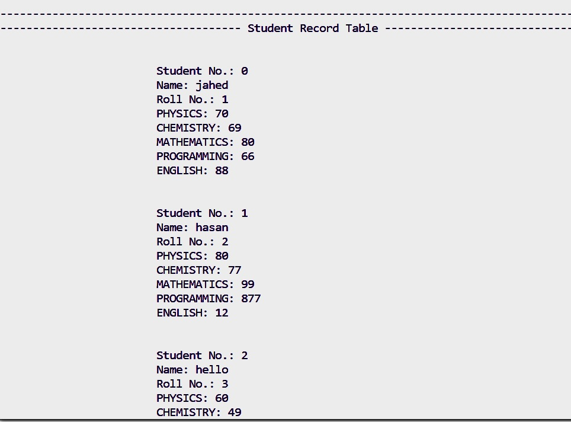
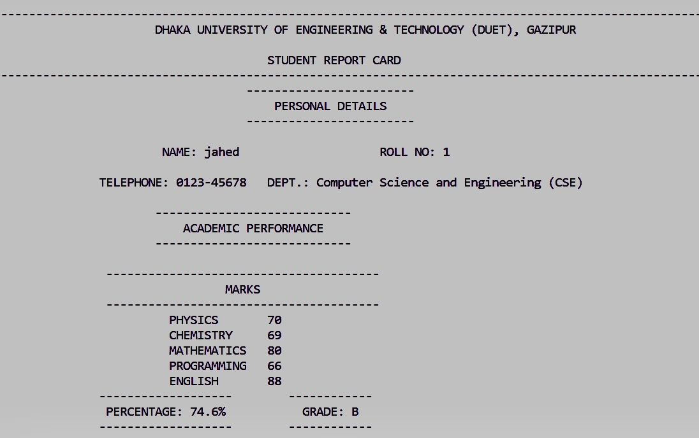

# Student Report Card (C++) by Yuktheshwar

## Project Overview

The **Student Report Card (C++)** project is a comprehensive console-based application designed to efficiently manage and generate student report cards using file-based storage. Developed in C++, this project provides a robust solution for educational institutions, teachers, and administrators to handle student academic records in a structured and user-friendly manner. The application encapsulates core functionalities such as adding, modifying, deleting, searching, and displaying student records, as well as generating detailed report cards based on individual student performance across multiple subjects.

### Key Objectives
- **Efficient Record Management:** Streamline the process of maintaining student academic data, reducing manual paperwork and minimizing errors.
- **User-Friendly Interface:** Offer an intuitive menu-driven interface that allows users to perform all operations with ease, even with minimal technical background.
- **Data Integrity:** Ensure the accuracy and consistency of student records through file-based storage and validation mechanisms.
- **Comprehensive Reporting:** Generate detailed report cards that reflect student performance, including subject-wise marks, average scores, and grade assignment based on predefined criteria.

### Technical Highlights
- **Object-Oriented Design:** Utilizes C++ classes and inheritance to model students, course marks, and result computation, promoting code reusability and maintainability.
- **File Handling:** Employs file I/O operations to persistently store and retrieve student records, ensuring data is retained across sessions.
- **Modular Structure:** Segregates functionalities into distinct methods for menu navigation, record insertion, modification, deletion, searching, and report generation.
- **Grade Calculation:** Implements a grading system that assigns grades (A-E) based on average marks, providing a clear assessment of student performance.
- **Cross-Platform Compatibility:** Designed to run on any system with a C++ compiler, making it accessible for a wide range of users.

### Use Cases
- **Schools and Colleges:** Manage student academic records and generate report cards for classes or batches.
- **Teachers:** Maintain up-to-date records of student performance and provide timely feedback.
- **Students:** Access their academic progress and understand areas of improvement.

This project serves as an excellent learning resource for students and developers interested in mastering file handling, object-oriented programming, and real-world application development in C++.

## Features
- Add, modify, delete, and search student records
- Generate and display report cards

## Screenshots

**Menu**

**Add Record**

**Display All Records**

**Report Card**

---
**Author:** Yuktheshwar  

[GitHub Repository](https://github.com/YUKII2K3/Student-Report-Card-C-.git)

